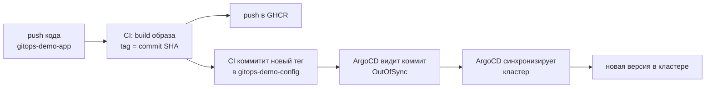

# gitops-demo-config

Конфигурационный репозиторий GitOps-системы: описывает желаемое состояние
приложения в кластере. За этим репозиторием следит ArgoCD и приводит кластер
в соответствие с тем, что здесь описано. Git является единственным источником
истины о том, что развёрнуто.

Парный репозиторий с кодом приложения: [gitops-demo-app](https://github.com/wwwplotnikov/gitops-demo-app).

## Как это работает



Агент ArgoCD внутри кластера сам сравнивает желаемое состояние (git) с реальным и устраняет
расхождение. CI лишь коммитит новый тег образа сюда, в config-репозиторий.

## Разделение на два репозитория

| Репозиторий | Отвечает за |
| ----------- | ----------- |
| gitops-demo-app | что собрать (исходный код в образ) |
| gitops-demo-config | что развернуть (состояние кластера) |

CI приложения связывает их: собирает образ и записывает его тег в `values.yaml`
этого репозитория. Дальше в дело вступает ArgoCD.

## Структура

```
gitops-demo-config/
├── charts/demoapp/          Helm-чарт приложения
│   ├── Chart.yaml
│   ├── values.yaml          тег образа (эту строку обновляет CI приложения)
│   └── templates/
│       ├── deployment.yaml
│       └── service.yaml
└── argocd/
    └── application.yaml      манифест ArgoCD Application
```

## ArgoCD Application

`argocd/application.yaml` подключает этот репозиторий к ArgoCD. Ключевые
настройки синхронизации:

| Настройка | Значение | Смысл |
| --------- | -------- | ----- |
| `source.repoURL` | этот репозиторий | ArgoCD следит за config, а не за кодом |
| `source.path` | `charts/demoapp` | путь к Helm-чарту |
| `syncPolicy.automated.selfHeal` | `true` | ручные изменения в кластере откатываются к git |
| `syncPolicy.automated.prune` | `true` | удалённое из git удаляется из кластера |
| `syncOptions: CreateNamespace` | `true` | namespace создаётся автоматически |

Применяется один раз:

```
kubectl apply -f argocd/application.yaml
```

## Ключевые решения

| Решение | Причина |
| ------- | ------- |
| Два отдельных репозитория (app и config) | разные жизненные циклы и права; config-репо это граница прода |
| ArgoCD следит за config-репо, а не за app-репо | здесь лежит желаемое состояние кластера; код сначала надо собрать в образ |
| Тег образа вынесен в `values.yaml` | чистые атомарные коммиты смены версии, читаемая история деплоев, откат через git revert |
| `selfHeal: true` | защита от drift: кластер не может уползти от описанного в git состояния |
| Версия приложения = тег образа = commit SHA | под репортит свой коммит, полная трассируемость развёрнутого |

## Требования

* Kubernetes-кластер (проект проверялся на kind)
* ArgoCD в кластере
* Helm
